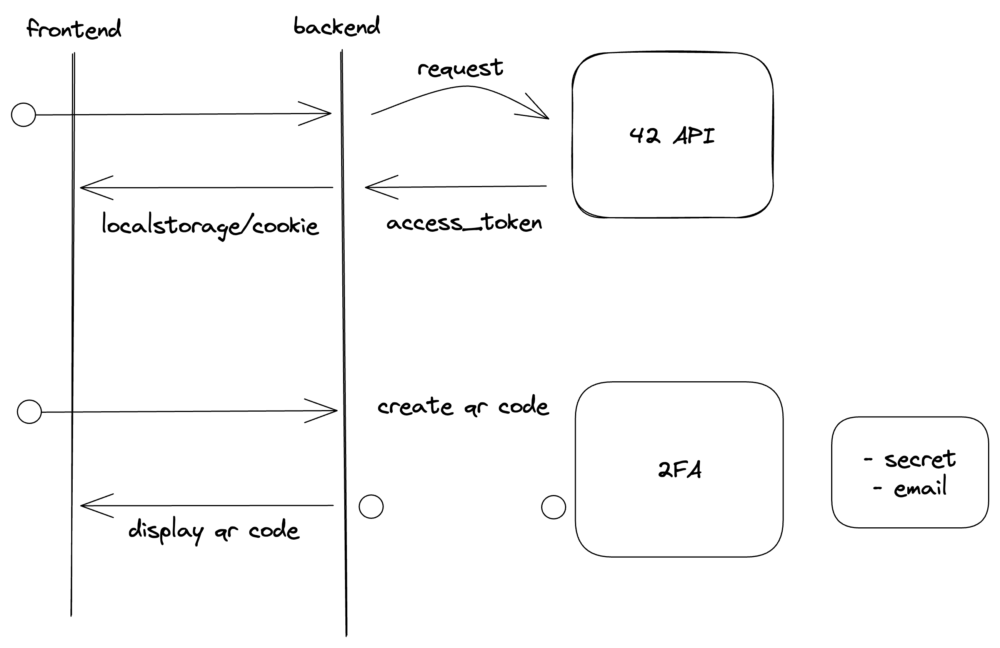

# ft_transcendance
<p align="center">  </p>
  
<div align="center">
  
</div>
  

> Project is in progress.. The final readme will come soon  
> From today you can use it to understand the basic concepts for the backend  
> I am gonna explain progressively how to install the basic structure of the project, using NestJS, PostgreSQL, Prisma for the backend, and ReactJS for the frontend.
  
## ⚙️ How to run the project?

1. Run `make` to install node_modules + to build the dockerized app
2. On a different terminal, after the project has been built, in the /project folder run `make gotoc` to go inside the backend container.
3. Run `npx prisma studio` to run the viewer for db.
4. Go to your navigator:  
    --> `localhost:3000`: for the frontend 
    --> `localhost:5555`: for prisma studio  

If you have any trouble running the project, try `Ctrl^C` + removing the node_modules (`make clean_modules`) then rebuild the docker.

## 📔 Summary

 - [🏗️ How to build a web app?](#%EF%B8%8F-how-to-build-a-web-app)
 - [🔄 Dynamic reload](#-dynamic-reload)
 - [🔙 Backend](#-backend)
 - [❔ How do I send a `POST` request to backend ?](#-how-do-i-send-a-post-request-to-backend-)
 - [🔗 How do I connect frontend with backend?](#-how-do-i-connect-frontend-with-backend)
 - [🚀 How to install PostgreSQL database and connect it to nestjs?](#-how-to-install-postgresql-database-and-connect-it-to-nestjs)
 - [🗃️ ressources](#%EF%B8%8F-ressources)

## 🏗️ How to build a web app?
At first, I didn't know where to start, so here are the steps to follow if you want to properly build your web application. The following instructions are precious, and could save you some time. 
  
  1. Install your frontend using the ReactJs framework  
  2. Dockerize your frontend (check my documentation on how to dynamicaly reload your page)  
  3. When this is done, install your backend using NestJs, PostgreSQL and Prisma ORM  
  4. Dockerize your backend (check my documentation on how to install your backend)  
  5. Then, finish by linking your frontend to your backend. Dockerize your full app from the root of the repository.  

Now that you have the project logic, we gonna go deeper into the building of your web application.  
Drop a star to support my work ⭐ Thank you  

## Potential mistakes!
````bash
Error validating field `post` in model `CategoriesOnPosts`: The relation field `post` on model `CategoriesOnPosts` is missing an opposite relation field on the model `Post`. Either run `prisma format` or add it manually.
````
This is coming from the prisma schema which is not well formated. Don't forget to add this line:
````prisma
model Post {
  id         Int                 @id @default(autoincrement())
  title      String
  // categories CategoriesOnPosts[] // <-- add this line to fix the issue
}

model Category {
  id    Int                 @id @default(autoincrement())
  name  String
  posts CategoriesOnPosts[]
}

model CategoriesOnPosts {
  post       Post     @relation(fields: [postId], references: [id]) // <-- the error comes from here 
  postId     Int // relation scalar field (used in the `@relation` attribute above)
  category   Category @relation(fields: [categoryId], references: [id])
  categoryId Int // relation scalar field (used in the `@relation` attribute above)
  assignedAt DateTime @default(now())
  assignedBy String

  @@id([postId, categoryId])
}
````

## 🗃️ ressources
#### docker and react live reload
https://medium.com/@chavezharris/live-reload-with-docker-and-react-3d6de03920af
#### postgres install
https://github.com/khezen/compose-postgres
#### install dockerize app with nestjs/postgreSQL and prisma
https://dev.to/mnzs/database-with-prisma-orm-docker-and-postgres-nestjs-with-passport-02-180l

#### nestjs api
https://www.youtube.com/watch?v=GHTA143_b-s&ab_channel=freeCodeCamp.org  
https://github.com/vladwulf/nestjs-api-tutorial  

#### Troubles dockerizing your app on Mac m1 chips?
https://pythonspeed.com/articles/docker-build-problems-mac/

#### Interesting forum
https://stackoverflow.com/questions/71251937/error-p1001-cant-reach-database-server-at-localhost5200  
pb1: un packet propre a l'architecture macos arm64 encore dans mon package.json (qui empechait mon backend de se lancer)  
pb2: le port 5432 qui etait pas accessible depuis mon back (il fallait remplacer localhost par ma db_name, et le port 5434 par le port 5432)  

#### install prisma studio inside docker-compose
https://hub.docker.com/r/timothyjmiller/prisma-studio  
npm i -D @prisma/cli@dev  
go inside container, copy the schema.prisma config in /schema.prisma.  
run `docker cp backend/prisma/schema.prisma backend_prisma:/schema.prisma`  
run `docker exec backend_prisma npx prisma migrate dev`  
go on the `localhost:5555` and it should be good  

#### how to switch from yarn package manager to npm?
https://stackoverflow.com/questions/51239726/react-native-switch-from-yarn-to-npm  

#### qr-code
to understand the logic:  
https://dev.to/hahnmatthieu/2fa-with-nestjs-passeport-using-google-authenticator-1l32  
then could not display the qr code on my page because of len overflow (too much data stored). So i managed to open a new window to show it.  
https://ourcodeworld.com/articles/read/682/what-does-the-not-allowed-to-navigate-top-frame-to-data-url-javascript-exception-means-in-google-chrome  
input field for the code:  
https://www.npmjs.com/package/react-auth-code-input?activeTab=readme  